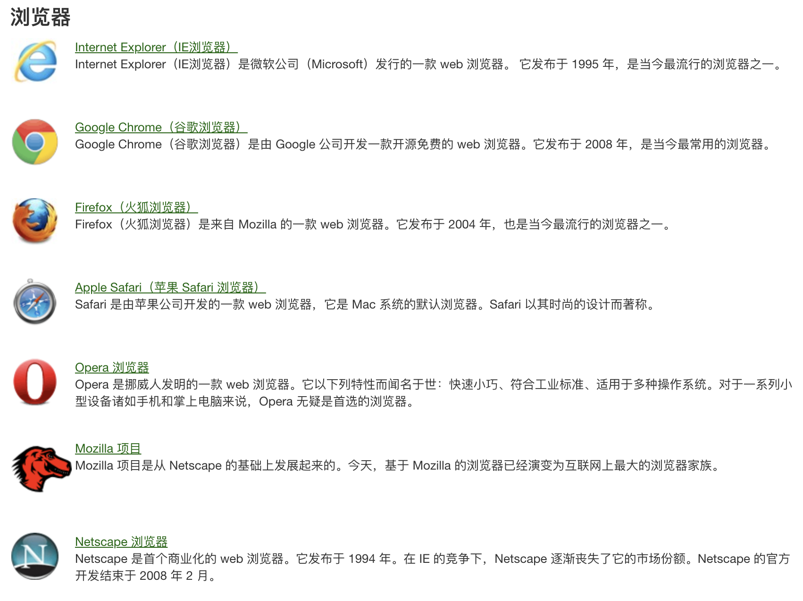
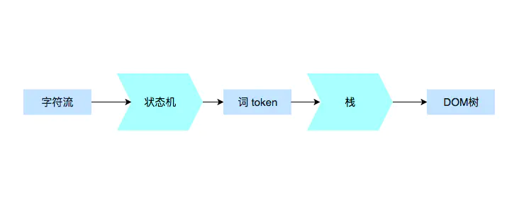
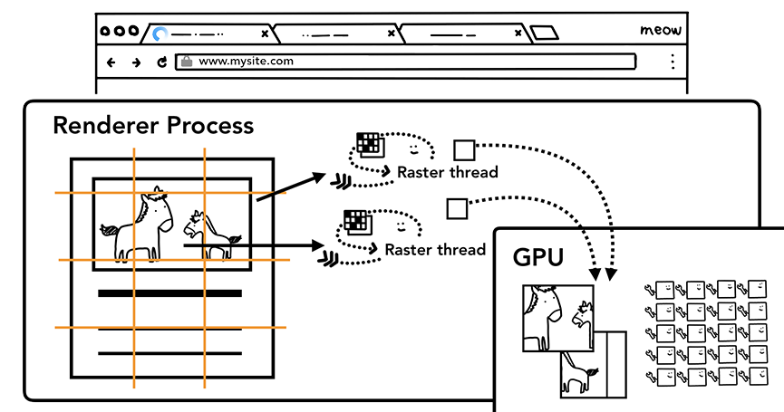
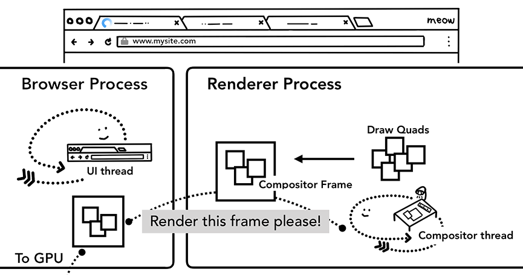

# 浏览器是如何工作的

## 简单版本
- 浏览器根据请求的 URL 交给 DNS 域名解析，找到真实 IP，向服务器发起请求；
- 服务器交给后台处理完成后返回数据，浏览器接收文件（HTML、JS、CSS、图像等）；
- 浏览器对加载到的资源（HTML、JS、CSS 等）进行语法解析，建立相对应的内部数据结构（如 HTML 的 DOM）；
- 载入解析到的资源文件，渲染页面，完成。

## 主流浏览器
- Internet Explorer（IE浏览器）是微软公司（Microsoft）发行的一款 web 浏览器。 它发布于 1995 年，是当今最流行的浏览器之一。
- Google Chrome（谷歌浏览器）是由 Google 公司开发一款开源免费的 web 浏览器。它发布于 2008 年，是当今最常用的浏览器。
- Firefox（火狐浏览器）是来自 Mozilla 的一款 web 浏览器。它发布于 2004 年，也是当今最流行的浏览器之一。
- Safari 是由苹果公司开发的一款 web 浏览器，它是 Mac 系统的默认浏览器。Safari 以其时尚的设计而著称。
- Opera 是挪威人发明的一款 web 浏览器。它以下列特性而闻名于世：快速小巧、符合工业标准、适用于多种操作系统。对于一系列小型设备诸如手机和掌上电脑来说，Opera 无疑是首选的浏览器。
- Mozilla 项目是从 Netscape 的基础上发展起来的。今天，基于 Mozilla 的浏览器已经演变为互联网上最大的浏览器家族。
- Netscape 是首个商业化的 web 浏览器。它发布于 1994 年。在 IE 的竞争下，Netscape 逐渐丧失了它的市场份额。Netscape 的官方开发结束于 2008 年 2 月。



> 实际上，对浏览器的实现者来说，他们做的事情，就是把一个 URL 变成一个屏幕上显示的网页。

这个过程是这样的：

1. 浏览器首先使用 HTTP 协议或者 HTTPS 协议，向服务端请求页面；
2. 把请求回来的 HTML 代码经过解析，构建成 DOM 树；
3. 计算 DOM 树上的 CSS 属性；
4. 最后根据 CSS 属性对元素逐个进行渲染，得到内存中的位图；
5. 一个可选的步骤是对位图进行合成，这会极大地增加后续绘制的速度；
6. 合成之后，再绘制到界面上。

我们在开始详细介绍之前，要建立一个感性认识。我们从 HTTP 请求回来开始，这个过程并非一般想象中的一步做完再做下一步，而是一条流水线。

从 HTTP 请求回来，就产生了流式的数据，后续的 DOM 树构建、CSS 计算、渲染、合成、绘制，都是尽可能地流式处理前一步的产出：即不需要等到上一步骤完全结束，就开始处理上一步的输出，这样我们在浏览网页时，才会看到逐步出现的页面。

### 解析代码


## 1. 词（token）是如何被拆分的
首先我们来看看一个非常标准的标签，会被如何拆分：

```HTML
<p class="a">text text text</p>
```

如果我们从最小有意义单元的定义来拆分，第一个词（token）是什么呢？显然，作为一个词（token），整个 p 标签肯定是过大了（它甚至可以嵌套）。

那么，只用 p 标签的开头是不是合适吗？我们考虑到起始标签也是会包含属性的，最小的意义单元其实是“<p” ，所以“ <p” 就是我们的第一个词（token）。

我们继续拆分，可以把这段代码依次拆成词（token）：

- <p“标签开始”的开始；
- class=“a” 属性；
- \>“标签开始”的结束；
- text text text 文本；
- </p> 标签结束。

## 2. 构建DOM树

接下来我们要把这些简单的词变成 DOM 树

在接收的同时，即开始构建 DOM 树，所以我们的主要构建 DOM 树的算法，就写在 receiveInput 当中。当接收完所有输入，栈顶就是最后的根节点，我们 DOM 树的产出，就是这个 stack 的第一项。

为了构建 DOM 树，我们需要一个 Node 类，接下来我们所有的节点都会是这个 Node 类的实例。

> 这个过程有点类似于词的拆分的过程

## 3. 加载次级的资源

网页中常常包含诸如图片，CSS，JS 等额外的资源，这些资源需要从网络上或者 cache 中获取。主进程可以在构建 DOM 的过程中会逐一请求它们，为了加速 preload scanner 会同时运行，如果在 html 中存在  <link> 等标签，preload scanner 会把这些请求传递给 Browser process 中的 network thread 进行相关资源的下载。

## 4. JS的下载与执行

当遇到 \<script> 标签时，渲染进程会停止解析 HTML，而去加载，解析和执行 JS 代码，停止解析 html 的原因在于 JS 可能会改变 DOM 的结构（使用诸如 documwnt.write()等 API）。

不过开发者其实也有多种方式来告知浏览器应对如何应对某个资源，比如说如果在\<script> 标签上添加了 async 或 defer 等属性，浏览器会异步的加载和执行 JS 代码，而不会阻塞渲染。更多的方法可参考 Resource Prioritization – Getting the Browser to Help You。

## 5. 样式计算

仅仅渲染 DOM 还不足以获知页面的具体样式，主进程还会基于 CSS 选择器解析 CSS 获取每一个节点的最终的计算样式值。即使不提供任何 CSS，浏览器对每个元素也会有一个默认的样式。
> 渲染进程主线程计算每一个元素节点的最终样式值


## 6. 获取布局
想要渲染一个完整的页面，除了获知每个节点的具体样式，还需要获知每一个节点在页面上的位置，布局其实是找到所有元素的几何关系的过程。其具体过程如下：

通过遍历 DOM 及相关元素的计算样式，主线程会构建出包含每个元素的坐标信息及盒子大小的布局树。布局树和 DOM 树类似，但是其中只包含页面可见的元素，如果一个元素设置了 display:none ，这个元素不会出现在布局树上，**伪元素虽然在 DOM 树上不可见，但是在布局树上是可见的。**


## 7. 绘制各元素

即使知道了不同元素的位置及样式信息，我们还需要知道不同元素的绘制先后顺序才能正确绘制出整个页面。在绘制阶段，主线程会遍历布局树以创建绘制记录。绘制记录可以看做是记录各元素绘制先后顺序的笔记。
> 主线程依据布局树构建绘制记录


## 8. 合成帧
熟悉 PS 等绘图软件的童鞋肯定对图层这一概念不陌生，现代 Chrome 其实利用了这一概念来组合不同的层。

复合是一种分割页面为不同的层，并单独栅格化，随后组合为帧的技术。不同层的组合由 compositor 线程（合成器线程）完成。

主线程会遍历布局树来创建层树（layer tree），添加了 will-change CSS 属性的元素，会被看做单独的一层。
> 主线程遍历布局树生成层树


你可能会想给每一个元素都添加上 will-change，不过组合过多的层也许会比在每一帧都栅格化页面中的某些小部分更慢。为了更合理的使用层，可参考 坚持仅合成器的属性和管理层计数 。

一旦层树被创建，渲染顺序被确定，主线程会把这些信息通知给合成器线程，合成器线程会栅格化每一层。有的层的可以达到整个页面的大小，因此，合成器线程将它们分成多个磁贴，并将每个磁贴发送到栅格线程，**栅格线程会栅格化每一个磁贴并存储在 GPU 显存中。**



一旦磁贴被光栅化，合成器线程会收集称为绘制四边形的磁贴信息以创建合成帧。

合成帧随后会通过 IPC 消息传递给浏览器进程，由于浏览器的 UI 改变或者其它拓展的渲染进程也可以添加合成帧，这些合成帧会被传递给 GPU 用以展示在屏幕上，如果滚动发生，合成器线程会创建另一个合成帧发送给 GPU。


> 合成器线程会发送合成帧给 GPU 渲染
合成器的优点在于，其工作无关主线程，合成器线程不需要等待样式计算或者 JS 执行，这就是为什么合成器相关的动画 最流畅，如果某个动画涉及到布局或者绘制的调整，就会涉及到主线程的重新计算，自然会慢很多。

## 参考文献

- (**好文推荐**)浏览器渲染引擎 (https://blog.csdn.net/weixin_36445197/article/details/106785275)
-  图解浏览器工作原理 原文链接 （https://zhuanlan.zhihu.com/p/47407398 ）
  
- 图解浏览器的工作原理 （https://www.infoq.cn/article/CS9-WZQlNR5h05HHDo1b）

- What really happens when you navigate to a URL 
  （http://igoro.com/archive/what-really-happens-when-you-navigate-to-a-url/）