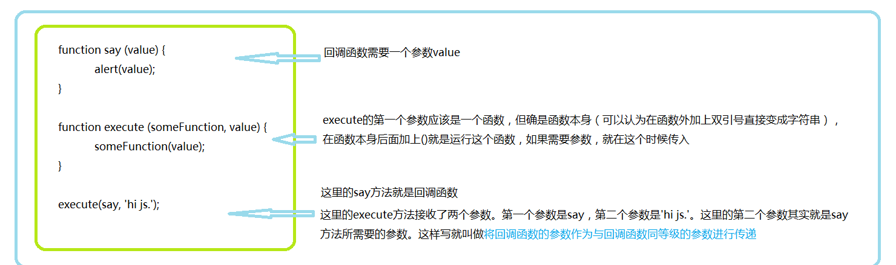
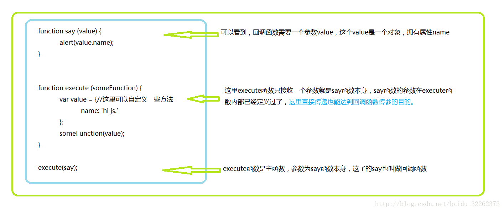

# 回调函数 

## 什么是回调函数
- 先来看看回调的英文定义：A callback is a function that is passed as an argument to another function and is executed after its parent function has completed。
    > 字面上的理解，回调函数就是传递一个参数化的函数，就是将这个函数作为一个参数传到另一个主函数里面，当那一个主函数执行完之后，再执行传进去的作为参数的函数。走这个过程的参数化的函数 就叫做回调函数。换个说法也就是被作为参数传递到另一个函数（主函数）的那个函数就叫做 回调函数。

-  举一个别人举过的例子：
约会结束后你送你女朋友回家，离别时，你肯定会说：“到家了给我发条信息，我很担心你。” 对不，然后你女朋友回家以后还真给你发了条信息。小伙子，你有戏了。其实这就是一个回调的过程。你留了个参数函数（要求女朋友给你发条信息）给你女朋友，然后你女朋友回家，回家的动作是主函数。她必须先回到家以后，主函数执行完了，再执行传进去的函数，然后你就收到一条信息了。

回调函数应用场景多用在使用 js 写组件时和耗时操作上面，尤其是组件的事件很多都需要回调函数的支持。

还是来看代码吧： 
```JS
<script type="text/javascript">
		function title(value){//这是回调函数！！！！
			alert(value);
		}
		function main(title, value){//这个主函数:在参数列表中，title作为一个参数传递进来，也就是上文说的 参数化函数；然后value这个值正是title（）函数中所需要的。
			alert("我是主函数");
			title(value);//结果为：'我是回调函数'。——————然后在这行这个title()，它就是回调函数咯。
		}
		main(title,"我是回调函数");//title参数加上()后，就会变回一个函数，并会被执行一次。
		//PS:看清楚，调用的是main()函数，意味着先执行main()，这时已经执行了主函数，title()被main()在函数体中执行了一次，因此title()是回调函数。
	</script>

```

## 回调函数容易混淆的点（传参）
- 一、将回调函数的参数作为与回调函数同等级的参数进行传递。
	
- 二、回调函数的参数在调用回调函数的内部创建。
	


